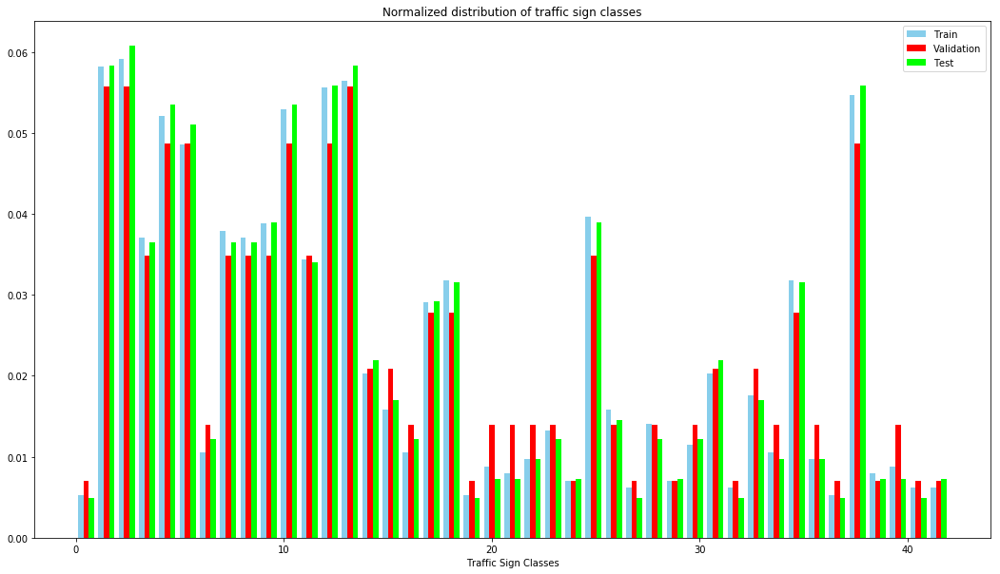
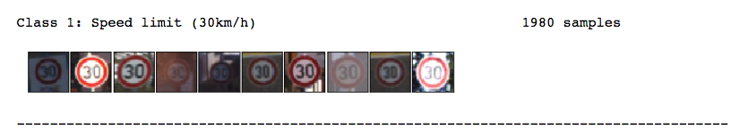
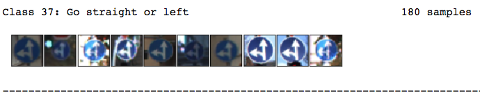
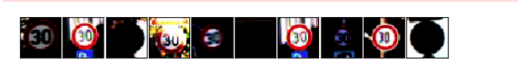
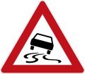

## Traffic Sign Classification

### 1. Overview
---
In this project, I used a deep neural networks and convolutional neural networks to classify traffic signs. I trained and validated a model so it can classify traffic sign images using the [German Traffic Sign Dataset](http://benchmark.ini.rub.de/?section=gtsrb&subsection=dataset). After training the model, I try it  out  on random images of German traffic signs find on the web.

The goals / steps of this project are the following:
* Load the data set (see below for links to the project data set)
* Explore, summarize and visualize the data set
* Design, train and test a model architecture
* Use the model to make predictions on new images
* Analyze the softmax probabilities of the new images
* Summarize the results with a written report

---

Here is a link to my [project code](https://github.com/mtagne/Self-Driving-Car-Udacity-CovNet-P2/blob/master/Traffic_Sign_Classifier.ipynb)

### 2. Data Set Summary & Exploration

#### 2.1. Provide a basic summary of the data set. In the code, the analysis should be done using python, numpy and/or pandas methods rather than hardcoding results manually.

I used the pandas library to calculate summary statistics of the traffic
signs data set:

* The size of training set is  34799
* The size of the validation set is 4410
* The size of test set is 12630
* The shape of a traffic sign image is 32x32x3 (3 cholor channel, RGB)
* The number of unique classes/labels in the data set is 43. Class of each image is encoded as an integer in a 0 to 42 range.

#### 2.2 Include an exploratory visualization of the dataset.

Here is an exploratory visualization of the data set. It is a bar chart showing   the normalized distribution of data for the 43 traffic signs. The salient point is that the relative number of data points varies  between each class. Basically the dataset is unbalanced. Some classes are represented more than others.  e.g. from around 6% (e.g. class 1) to 0.5% (e.g. class 37), i.e. a factor of at least 11 difference (6%/ 0.5%), this can potentially impact classification performance.

#### 2.3 preprocessing

The image used are preprocessed. All images were normalized pixels in each color channel (RGB - 3 channels with values between 0 to 255) to be between -1 to 1,  by performing the divide operation : (128-value)/128.  Data augmentation  grayscale normalization were not necessary.

Here is an example of a traffic sign image before and after  data preprocessing :
#### Before preprocessing

#### After preprocessing

The difference between the original data set and the the normalized set is the consistent constrast between normalized images.

### 3. Design Model

#### 3.1 Architecture

Given the relatively low resolution of the images, I started with Lenet example. To  improve training I added dropout (in early layers) with RELU rectifier functions. I came accross   self-normalizing rectifier function(SELU) litterature recently and decided to give it a try  instead of RELU. The result was marginally better after many epochs, but trained much faster ( > 90% in one epoch), consequently I kept SELU in the original. For more information about SELU check out the paper [Self-Normalizing Neural Networks](https://arxiv.org/pdf/1706.02515.pdf).

I  use a deep neural network classifier as a model, which was based on  [Pierre Sermanet / Yann LeCun paper](http://yann.lecun.com/exdb/publis/pdf/sermanet-ijcnn-11.pdf). It has 8 layers: 2 convolutional layers for feature extraction, 2 max pooling (2x2 filter size) layers for downsampling and overfitting control and  4 fully connected layer as a classifier.

Moreover, to improve the training  I added dropout to minimize overfitting
My final model consisted of the following layers:

|      Layer      |                 Description                 |
|:---------------:|:-------------------------------------------:|
|      Input      |              32x32x3 RGB image              |
| Convolution 5x5 | 1x1 stride, valid padding, outputs  28x28x6 |
|      Dropout    |         keep_prob = 0.9                  |
|			SELU        |							                            |
|   Max pooling   |        2x2 stride,  outputs 16x16x64        |
| Convolution 5x5 | 1x1 stride, valid padding, outputs  10x10x16 |
|			SELU        |							                            |
|      Dropout    |         keep_prob = 0.9                  |
|   Max pooling   |        2x2 stride,  outputs 5x5x16        |
|   Flatten       |  output dimension 400                     |
|   Fully connected  | output dimension 120                 |
|			SELU        |							                            |
|   Fully connected  | output dimension 84                 |
|			SELU        |							                            |
|   Fully connected  | output dimension 84                 |
|     SELU |                 |
| Fully connected|                  output dimension 43                     |

#### 3.2 Describe how you trained your model. The discussion can include the type of optimizer, the batch size, number of epochs and any hyperparameters such as learning rate.

To trained my model, I used an Adam optimizer with learning rate of 0.002, 20 epochs  and batch size of 256. The model converged fast due SELU and specific initialization scheme used. I trained my model using an AWS g2 EC2 instance.

#### 3.3. Describe the approach taken for finding a solution and getting the validation set accuracy to be at least 0.93. Include in the discussion the results on the training, validation and test sets and where in the code these were calculated. Your approach may have been an iterative process, in which case, outline the steps you took to get to the final solution and why you chose those steps. Perhaps your solution involved an already well known implementation or architecture. In this case, discuss why you think the architecture is suitable for the current problem.

I modified the  Lenet  model by adding dropout layers to improved the test accuracy and SELU improved training speed. The inital  data sets were quite unbalanced (see data exploration graph), so reshuffling and creating new training/validation/test sets  helped.

My final model results were:

validation set accuracy of 0.98 (between 0.90 ~ 0.982)
test set accuracy of 0.98

If an iterative approach was chosen:

What was the first architecture that was tried and why was it chosen?

I iniatially started with Lenet and progressively added dropout and then several SELU layers. Also added more fully connected layers.

What were some problems with the initial architecture?

The result was not satisfactory before I added dropout to prevent overfitting.

Which parameters were tuned? How were they adjusted and why?
I tinkered with several combinations of learning rates. The number of  epochs after adding SELU can be minized. I used the same keep probability rate for dropout.

Since the difference between  the validation accuracy and the test accuracy is minimal, the model seems to be working well. The loss is also quite low (0.02), so little to gain most likely - at least without changing the model.

### 4. Test a Model on New Images

#### 4. 1. Choose five German traffic signs found on the web and provide them in the report. For each image, discuss what quality or qualities might be difficult to classify.

Here are five German traffic signs that I found on the web:

My first selection of images were not part of any of the 43 classes. As a result if was not possible to classify my selection properly.  As a result I replace all signs in my initial selection by items belonging to the 43 classes. My source of images is [wikipedia](https://en.wikipedia.org/wiki/Road_signs_in_Germany)

#### 4.2. Discuss the model's predictions on these new traffic signs and compare the results to predicting on the test set. At a minimum, discuss what the predictions were, the accuracy on these new predictions, and compare the accuracy to the accuracy on the test set (OPTIONAL: Discuss the results in more detail as described in the "Stand Out Suggestions" part of the rubric).

Here are the results of the prediction:

| Image			        |     Prediction	        					|
|:---------------------:|:---------------------------------------------:|
| Priority road     		| Priority road  									|
| Roundabout    			| Speed limit (30km/h)										|
| Slippery road					| Slippery road											|
| Stop	      		| Stop					 				|
| Wild animals crossing		| Wild animals crossing     							|

The model was able to correctly guess 4 of the 5 traffic signs, which gives an accuracy of 80%.  For the roundabout,  the result is a 25% probability. It predicts 75% probability for a 30 km/h speeed limit sign. This result is puzzling because the two signs are not quite similar.

#### 4.3. Describe how certain the model is when predicting on each of the five new images by looking at the softmax probabilities for each prediction. Provide the top 5 softmax probabilities for each image along with the sign type of each probability. (OPTIONAL: as described in the "Stand Out Suggestions" part of the rubric, visualizations can also be provided such as bar charts)

The code for making predictions on my final model is located in the 11th cell of the Ipython notebook.

For the first image, the model is relatively sure that this is a priority road sign (probability of 1), and the image does contain a priority road sign. The top five soft max probabilities were:

| Probability         	|     Prediction	        					            |
|:---------------------:|:---------------------------------------------:|
| 1.00         			    | Priority road   									                |
| 0.00     				      | Yield										                    |
| 0.00					          | Traffic signals											                    |
| 0.00	      			      | Right-of-way at the next intersection					 				                  |
| 0.00				            | Turn left ahead      							              |

For the second image, the model could not ascertain that thi is a Roundabout sign (probability of 0.26). The top five soft max probabilities were :

| Probability         	|     Prediction	        					            |
|:---------------------:|:---------------------------------------------:|
| 0.74         			    | Speed limit (30km/h)  									                |
| 0.26     				      | Roundabout mandatory										                    |
| 0.02					          | Speed limit (100km/h)											                    |
| 0.00	      			      | Right-of-way at the next intersection					 				                  |
| 0.00				            | End of no passing      							              |

For the third image, the model is relatively sure that this is a slippery road sign (probability of 0.99), and the image does contain a slippery road sign. The top five soft max probabilities were:

| Probability         	|     Prediction	        					            |
|:---------------------:|:---------------------------------------------:|
| 0.99         			    | Slippery road  									                |
| 0.01     				      | Beware of ice/snow										                    |
| 0.00					          | Right-of-way at the next intersection										                    |
| 0.00	      			      | 	Children crossing				 				                  |
| 0.00				            | No passing      							              |

For the fourth image, the model is relatively sure that this is a stop sign (probability of 0.99), and the image does contain a top sign. The top five soft max probabilities were:

| Probability         	|     Prediction	        					            |
|:---------------------:|:---------------------------------------------:|
| 0.99         			    | Stop 									                |
| 0.00     				      | Speed limit (30km/h)										                    |
| 0.00					          | Speed limit (50km/h) intersection										                    |
| 0.00	      			      | 	Road work				 				                  |
| 0.00				            | Speed limit (70km/h)     							              |

For the fifth image, the model is relatively sure that this is a wild animals crossing sign (probability of 0.99), and the image does contain a wild animals crossing sign. The top five soft max probabilities were:

| Probability         	|     Prediction	        					            |
|:---------------------:|:---------------------------------------------:|
| 1.00         			    | Wild animals crossing 									                |
| 0.00     				      | Double curve										                    |
| 0.00					          | Road work 										                    |
| 0.00	      			      | 	Speed limit (50km/h)				 				                  |
| 0.00				            | General caution     							              |

### (Optional) Visualizing the Neural Network (See Step 4 of the Ipython notebook for more details)
#### 1. Discuss the visual output of your trained network's feature maps. What characteristics did the neural network use to make classifications?
